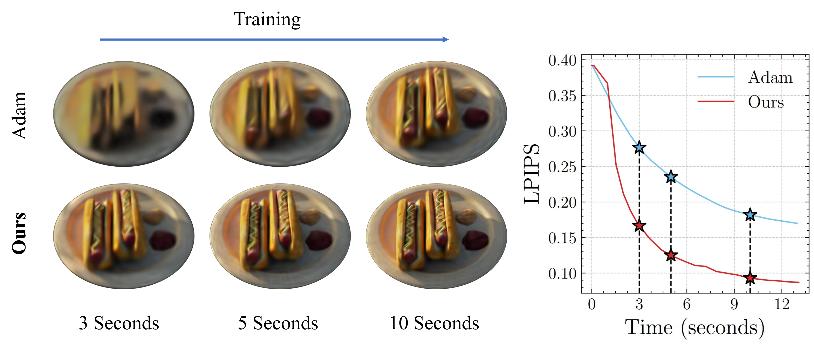

# Matrix-free Second-order Optimization of Gaussian Splats with Residual Sampling 
[Hamza Pehlivan](https://people.mpi-inf.mpg.de/~hpehliva/), [Andrea Boscolo Camiletto](https://abcamiletto.com/), [Lin Geng Foo](https://lingeng.foo/), [Marc Habermann](https://people.mpi-inf.mpg.de/~mhaberma/), [Christian Theobalt](https://people.mpi-inf.mpg.de/~theobalt/) <br>
| [Webpage](https://vcai.mpi-inf.mpg.de/projects/LM-IS/) | [Full Paper](https://arxiv.org/abs/2504.12905) |<br>


We provide the official implementation for our paper "Matrix-free Second-order Optimization of Gaussian Splats with Residual Sampling".

<a href="https://www.mpi-inf.mpg.de/home/"> </a>
<a href="https://saarland-informatics-campus.de/en/"> </a>

<section class="section" id="BibTeX">
  <div class="container is-max-desktop content">
    <h2 class="title">BibTeX</h2>
    If you find our work useful, please cite it with the following bibtex entry: 
    <pre><code>@article{pehlivan2025second,
        title={Second-order Optimization of Gaussian Splats with Importance Sampling},
        author={Pehlivan, Hamza and Boscolo Camiletto, Andrea and Foo, Lin Geng and Habermann, Marc and Theobalt, Christian},
        journal={arXiv preprint arXiv:2504.12905},
        year={2025}
}</code></pre>
  </div>
</section>

## LICENSE

This work is licensed under Attribution-NonCommercial-ShareAlike 4.0 International license. See the [LICENSE.md](LICENSE.md) file for the description.  

## Cloning the Repository

The repository contains submodules, thus clone it with ```--recursive``` option: 

```shell
# HTTPS
git clone --recursive https://github.com/hamzapehlivan/lm-rs.git
```

If you already cloned the repository without the --recursive option, run:
```
git submodule update --init --recursive
```

## Overview

Our method introduces a second-order optimizer for training 3D Gaussian splats. Below, we summarize the key modifications compared to the original 3DGS framework: 
- [**Camera Sampler:**](scene/camera_sampler/clusterdir_sampler.py) K-Means clustering based camera sampler. 
- [**Pixel Sampler:**](scene/pixel_sampler/uniform_sampler.py) The pixel sampling strategy to subsample Jacobians to increase efficiency. 
- [**Dynamic Learning Rate Scheduler:**](scene/optim_strategy/cgOptimizer.py) The implementation of our dynamic learning rate scheduler. 
- [**CG Solver**](scene/optim_strategy/solvers/cg.py) The implementation of the preconditioned conjugate gradient solver. 
- We provide custom CUDA implementation to compute approximated Jacobian-vector products, which uses [forward-mode differentiation](submodules/diff-gaussian-rasterization/cuda_rasterizer/optimizerKernels/kernel/JTJv.cu) and [dual numbers](submodules/diff-gaussian-rasterization/cuda_rasterizer/dual_numbers/dual_numbers.h).

## Second-order Optimizer

The optimizer has been implemented as a CUDA extension within the PyTorch framework.

### Hardware Requirements

- CUDA-enabled GPU with at least 16 GB VRAM. We used NVIDIA Tesla A40 and A100 GPUs. 
- The code has been tested on Debian 12. Windows is not supported yet. 

### Software Requirements
- [Miniconda](https://www.anaconda.com/docs/getting-started/miniconda/main) is used for environment installation.
- The code is tested with CUDA Toolkit 11.8. Please download it from the Nvidia [website](https://developer.nvidia.com/cuda-11-8-0-download-archive), and configure it properly after the installation by setting up the path environment variables. An example is given as: 

```bash
cuda_version=11.8
export PATH=/usr/lib/cuda-${cuda_version}/bin:${PATH}
export LD_LIBRARY_PATH=/usr/lib/cuda-${cuda_version}/lib64${LD_LIBRARY_PATH:+:${LD_LIBRARY_PATH}}
export CUDA_PATH=/usr/lib/cuda-${cuda_version}/
```
Make sure to change the exported paths according to your actual installation paths.  
### Setup

#### Local Setup

We recommend installation with Conda package manager with the following command: 
```shell
conda env create --file environment.yml
conda activate lm-rs
```

And compile the custom CUDA extension with:
```shell
bash scripts/compile.sh
```
### Datasets

We trained and evaluated our method in [NeRF Synthetic](https://www.matthewtancik.com/nerf), [MipNeRF360 Indoor](https://jonbarron.info/mipnerf360/) datasets. In addition, we used the scenes from Tanks & Temples, and DeepBleending given in [3DGS repository](https://repo-sam.inria.fr/fungraph/3d-gaussian-splatting/datasets/input/tandt_db.zip).  Please follow the respective links to download the scenes. 

### Running

We provide bash scripts to run our optimizer. Make sure the following scripts point to the correct data folders. By default, we assume that the scenes are stored in ```datasets``` folder:  

```shell
# Run on mipnerf scenes
bash scripts/run_mipnerf_indoor.sh
# Run on Deep Blending scenes
bash scripts/run_deepblending.sh
# Run on Tanks & Temples scenes
bash scripts/run_tandt.sh
# Run on Nerf synthetic scenes
bash scripts/run_synthetic.sh
```

<details>
<summary><span style="font-weight: bold;">Important Command Line Arguments for train.py</span></summary>

  #### --source_path / -s
  Path to the source directory containing a COLMAP or Synthetic NeRF data set.
  #### --model_path / -m 
  Path where the trained model should be stored (```output/<random>``` by default).
  #### --images / -i
  Alternative subdirectory for COLMAP images (```images``` by default).
  #### --eval
  Add this flag to use a MipNeRF360-style training/test split for evaluation.
  #### --resolution / -r
  Specifies resolution of the loaded images before training. If provided ```1, 2, 4``` or ```8```, uses original, 1/2, 1/4 or 1/8 resolution, respectively. For all other values, rescales the width to the given number while maintaining image aspect. **If not set and input image width exceeds 1.6K pixels, inputs are automatically rescaled to this target.**
  #### --iterations
  Number of total iterations to train for, ```400``` by default.
  #### --ip
  IP to start GUI server on, ```127.0.0.1``` by default.
  #### --port 
  Port to use for GUI server, ```6009``` by default.
  #### --test_iterations
  Space-separated iterations at which the training script computes PSNR over test set, ```7000 30000``` by default.
  #### --save_iterations
  Space-separated iterations at which the training script saves the Gaussian model, ```7000 30000 <iterations>``` by default.
  #### --checkpoint_iterations
  Space-separated iterations at which to store a checkpoint for continuing later, saved in the model directory.
  #### --start_checkpoint
  Path to a saved checkpoint to continue training from.
  #### --quiet 
  Flag to omit any text written to standard out pipe.
  #### --auto_lr
  Enables the automatic learning rate determination algorithm described in the paper. 
  #### --max_lr
  Caps the learning rate at the max_lr. Automatic learning rate determination is not always reliable, therefore we apply this limit. Default 0.2
  #### --sampling_distribution
  The distribution to use when performing pixel sampling. Default is 'uniform'. Possible values are 'uniform', 'loss_map', 'gaussian_count'. 
  #### --camera_sampler
  Specifies the camera sampling algorithm. Default is 'clusterdir', which takes direction and location of the cameras into account. Possible values are 'clusterdir', 'cluster', 'uniform'. 
  #### --cgiter_values
  A comma-separated list defining the maximum number of Conjugate Gradient (CG) iterations at different stages of training.

  Always used together with ```--cgiter_breakpoints``` to implement a step schedule for the maximum CG iterations.
  #### --cgiter_breakpoints
  A comma-separated list of training iteration milestones at which the maximum number of CG iterations change.
  For example:

  ```shell 
  --cgiter_values="3,8" --cgiter_breakpoints="50"
  ```
  means:
  - For iterations < 50 → maximum CG iterations = 3
  - For iterations ≥ 50 → maximum CG iterations = 8
  #### --batchsize_values
  A comma-separated list defining the batch size at different stages of training. Always used together with ```--batchsize_breakpoints``` to implement a step schedule for batch size.
  #### --batchsize_breakpoints
  A comma-separated list of training iteration milestones at which the batch size changes. Similar to the above ```--cgiter_breakpoints``` argument. 
  #### --loss_fn
  The loss function to be used. It can be either 'mse' which implements the mean squared error,  or 'mse_approx_ssim', which implements the mean squared error + approximated ssim loss. The default is ```mse```. 
  #### --lambda_dssim
  Influence of SSIM on total loss from 0 to 1, ```0.0``` by default. Only has effect if ```--loss_fn="mse_approx_ssim"```
  #### --regularizer
  The damping parameter used in the solver. We used different defaults for different datasets. Please see the respective bash scripts for their assigned values. 
</details>
<br>

### Evaluation
To run the evaluation on the trained models run: 
```shell
python render.py -m <path to trained model> # Generate renderings
python metrics.py -m <path to trained model> # Compute error metrics on renderings
```

<details>
<summary><span style="font-weight: bold;">Command Line Arguments for render.py</span></summary>

  #### --model_path / -m 
  Path to the trained model directory you want to create renderings for.
  #### --skip_train
  Flag to skip rendering the training set.
  #### --skip_test
  Flag to skip rendering the test set.
  #### --quiet 
  Flag to omit any text written to standard out pipe. 

  **The below parameters will be read automatically from the model path, based on what was used for training. However, you may override them by providing them explicitly on the command line.** 

  #### --source_path / -s
  Path to the source directory containing a COLMAP or Synthetic NeRF data set.
  #### --images / -i
  Alternative subdirectory for COLMAP images (```images``` by default).
  #### --eval
  Add this flag to use a MipNeRF360-style training/test split for evaluation.
  #### --resolution / -r
  Changes the resolution of the loaded images before training. If provided ```1, 2, 4``` or ```8```, uses original, 1/2, 1/4 or 1/8 resolution, respectively. For all other values, rescales the width to the given number while maintaining image aspect. ```1``` by default.

</details>

<details>
<summary><span style="font-weight: bold;">Command Line Arguments for metrics.py</span></summary>

  #### --model_paths / -m 
  Space-separated list of model paths for which metrics should be computed.
</details>
<br>

## Interactive Viewers
Since we built our method on top of [3DGS](https://github.com/graphdeco-inria/gaussian-splatting), we support SIBR-based viewers. Please refer 3DGS [repository](https://github.com/graphdeco-inria/gaussian-splatting?tab=readme-ov-file#interactive-viewers) for installation. 

### Testing
The results of CUDA-accelerated jacobian-vector products can be compared with ground truth products with 
```shell
bash tests/tester.sh
```
To reduce computational overhead associated with large Jacobians, the tests are conducted on 100×100 images using 10K Gaussians. This script does the followings:
1. Trains 10K Gaussian Splats with Adam optimizer for 1000 iterations.  
2. Extracts the ground truth Jacobian matrices obtained from above checkpoint using PyTorch's automatic differentiation.
3. Computes matrix-free Jacobian-vector product results using our CUDA implementation.
4. Computes ground truth Jacobian-vector products from Step 2, and compares it with the CUDA-accelerated results obtained in Step 3. 

Since we compute the dense ground truth Jacobians, this test requires at least 35 GB memory, and can take up to 20 minutes to complete in the first run.  


